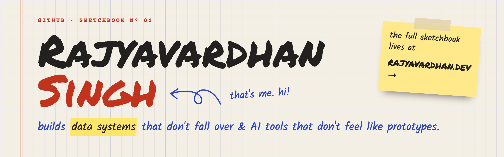

<a href="https://rajyavardhan.dev">
  <picture>
    <source media="(prefers-color-scheme: dark)" srcset="assets/banner-dark.jpg" />
    
  </picture>
</a>

### ✎ About

Software engineer at **Tech Mahindra**, building enterprise data pipelines with Python, Databricks and Azure.
After hours I make developer tools: terminal apps, native macOS utilities and multi-LLM tooling —
small, fast and local-first where it matters.

**Now:** shipping [Spectre](https://github.com/imrajyavardhan12/spectre-ghostty-config) and [Margin](https://github.com/imrajyavardhan12/Margin), and tinkering with [openreadiness](https://github.com/imrajyavardhan12/openreadiness).

### ✎ Selected work

<table>
<tr>
<td width="50%" valign="top">

**[Spectre](https://github.com/imrajyavardhan12/spectre-ghostty-config)** &nbsp; 
Visual config studio for the Ghostty terminal — live WASM preview, hundreds of themes, shareable configs. 
`Next.js` · `TypeScript` · `WASM` · [live →](https://spectre-ghostty-config.vercel.app)

</td>
<td width="50%" valign="top">

**[Margin](https://github.com/imrajyavardhan12/Margin)** 
Keyboard-first terminal diff viewer for Git changes, patches and AI-authored code. Installs with Homebrew. 
`Rust` · `Ratatui` · [docs →](https://imrajyavardhan12.github.io/Margin/)

</td>
</tr>
<tr>
<td width="50%" valign="top">

**[VaultMind](https://github.com/imrajyavardhan12/VaultMind)** &nbsp; 
Local-first CLI that compiles clipped sources into a living, LLM-maintained Obsidian wiki. 
`Python` · `LLM`

</td>
<td width="50%" valign="top">

**[LocalPorts](https://github.com/imrajyavardhan12/LocalPorts)** 
Fast macOS port inspector — shows listening processes in a few milliseconds. Ships via Homebrew. 
`Zig`

</td>
</tr>
</table>

**Also on the desk:**
[Proompt](https://github.com/imrajyavardhan12/Proompt) (prompt compiler — Rust CLI + Tauri app) ·
[Omnimind](https://github.com/imrajyavardhan12/Omnimind) (multi-model chat) ·
[copyloom](https://github.com/imrajyavardhan12/copyloom) (macOS clipboard workspace) ·
[privacy-canvas](https://github.com/imrajyavardhan12/privacy-canvas) (local-first image privacy) ·
[folio](https://github.com/imrajyavardhan12/folio) (native PDF workspace) ·
[Linear Algebra Visualizer](https://github.com/imrajyavardhan12/Linear-Algebra-Visualizer) ·
[all repositories →](https://github.com/imrajyavardhan12?tab=repositories)

### ✎ Stack

<table>
<tr><td><b>Data</b></td><td>Python · Databricks · Apache Spark · Azure Data Factory</td></tr>
<tr><td><b>Cloud</b></td><td>Microsoft Azure · Cloudflare · Docker · CI/CD</td></tr>
<tr><td><b>Apps</b></td><td>TypeScript · React · Next.js · Rust · Zig · Swift</td></tr>
</table>

### ✎ Certifications

### ✎ On GitHub

<picture>
  <source media="(prefers-color-scheme: dark)" srcset="https://github-readme-streak-stats.herokuapp.com/?user=imrajyavardhan12&theme=dark&hide_border=true&background=0D1117&ring=FF7B72&fire=FF7B72&currStreakLabel=FF7B72" />
  
</picture>

<picture>
  <source media="(prefers-color-scheme: dark)" srcset="https://raw.githubusercontent.com/imrajyavardhan12/imrajyavardhan12/output/snake-dark.svg" />
  
</picture>

**कर्मण्येवाधिकारस्ते मा फलेषु कदाचन**

<i>karmaṇy-evādhikāras te mā phaleṣu kadācana</i> You have the right to act, but never to the fruits of action. — Bhagavad Gita 2.47

